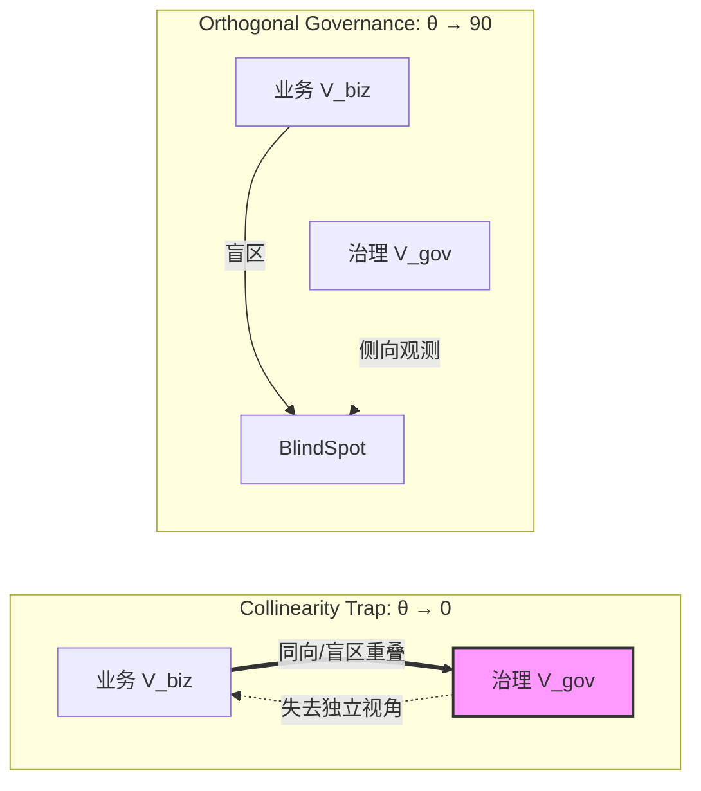

# 总体公式：治理物理学的第一性原理

> “如果一个控制系统的观测轴与被控系统的运动轴完全重合，那么这个控制系统不仅是无效的，而且会成为加速崩溃的反馈放大器。” —— 正交性定理

## 1. 核心命题：熵增与共线性

超大型系统的核心威胁不是外部竞争，而是内部的**热力学熵增**。在组织中，这种熵增表现为“高熵有序”——表面上KPI全绿、流程完美，实质上信息失真、创新停滞、风险累积。

导致熵增的根本几何结构是**共线性（Collinearity）**。

### 1.1 两个向量
定义系统的两个核心向量：
- **$\vec{V}_{biz}$（业务向量）**：代表系统追求的目标方向（如增长、速度、利润）。
- **$\vec{V}_{gov}$（治理向量）**：代表系统自我修正的力量（如审计、风控、SRE）。

### 1.2 几何图解

### 1.3 治理效能公式
治理的有效性（Effectiveness, $E$）不是治理资源的投入量（$|\vec{V}_{gov}|$），而是它在正交维度上的投影：

$$ E = |\vec{V}_{gov}| \cdot \sin(\theta) $$

其中 $\theta$ 是 $\vec{V}_{biz}$ 与 $\vec{V}_{gov}$ 之间的夹角。

- **当 $\theta \to 0^\circ$（共线性陷阱）**：
  治理向量与业务向量同向或反向但线性相关。此时 $\sin(\theta) \to 0$，治理效能归零。监督者沦为业务的附庸或同谋，审计报告变成“为了证明业务正确”的赞美诗。

- **当 $\theta \to 90^\circ$（正交治理）**：
  治理向量独立于业务向量。此时 $\sin(\theta) \to 1$，治理效能最大化。观测者拥有独立的坐标系，能够发现业务视角盲区中的风险。

## 2. 动力学：制度衰减律

热力学第二定律在组织中的推论是：**在封闭系统中，治理夹角 $\theta$ 会随时间自然衰减趋向于 0。**

$$ \frac{d\theta}{dt} = -k \cdot \text{Cost}(\theta) $$

维持正交性是昂贵的（需要独立的预算、独立的汇报线、独立的价值观），而顺从（共线性）是舒适且低能耗的。因此，任何未经持续做功维持的治理体系，都会不可避免地滑向共线性陷阱。

## 3. 两个关键指数

为了量化这一过程，本书引入两个核心指标：

### 3.1 CSI (Collusion Susceptibility Index) - 合谋易感度
衡量系统滑向共线性陷阱的风险。CSI 越高，说明系统越容易形成“上下级合谋”或“部门间互保”的稳定结构。

### 3.2 OGI (Orthogonal Governance Index) - 正交治理指数
衡量系统对抗熵增的能力。OGI 越高，说明系统越能容忍异见、保护独立观测通道（T2通道），并具备自我纠错的活性。

## 4. 本书的任务

本书不是教你如何加强 $\vec{V}_{gov}$ 的模长（增加更多的人手和流程），而是教你如何**工程化地维持 $\theta$**。

这是一门关于**角度**的工程学。我们将探讨：
1.  如何设计**正交的观测架构**（Orthogonal Observability）。
2.  如何构建**阻尼机制**对抗夹角衰减。
3.  如何在算法和AI时代，防止**数字化共线性**导致的系统性崩塌。

---
*注：本章的详细数学推导与证明见 [附录G：正交治理的数学原理](./appendix-g-math-principles-orthogonal-governance.md)*
